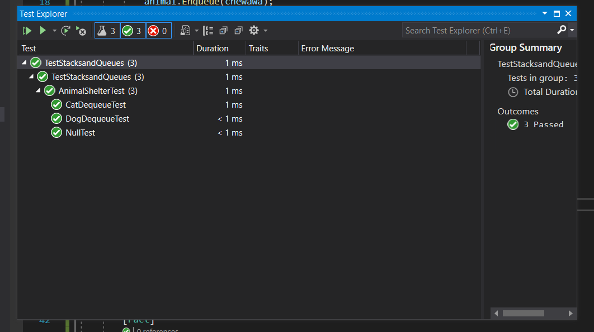

# Challenge Summary :

i needs to Create a class called AnimalShelter which holds only dogs and cats using Queue with first-in, first-out approach.

## Approach & Efficiency :
BIG O : O(1) fore both Enqueue and Dequeue.

## API

Enqueue :
Arguments: animal

animal can be either a dog or a cat object.

Dequeue :
Arguments: pref

pref can be either "dog" or "cat", Return: either a dog or a cat, based on preference, If pref is not "dog" or "cat" then return null.

## test 

## code :

 public class AnimalShelter
    {
        public Queue<Cat> Cat = new Queue<Cat>();
        public Queue<Dog> Dog = new Queue<Dog>();

        public void Enqueue(Animal animal)
        {
            
            if (animal is Cat)
            {
                Cat cat = new Cat();

                Cat.Enqueue(cat);
            }
            else if (animal is Dog)
            {
                Dog dog = new Dog();

                Dog.Enqueue(dog);
            }
        }

        public Animal Dequeue(string pref)
        {
            if (pref == "cat")
            {
                return Cat.Dequeue();

            }
            else if (pref == "dog")
            {
                return Dog.Dequeue();
            }
            return null;
        }

        