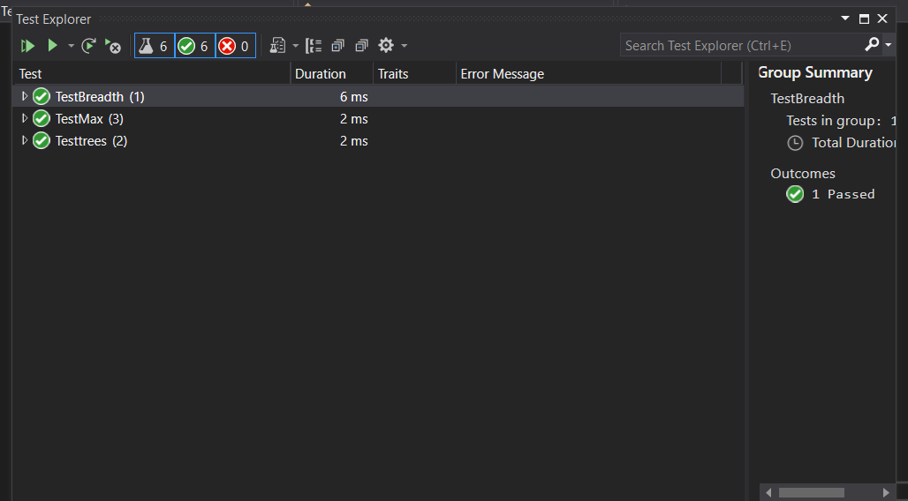

# breadth first

Write a function called breadth first that takes Arguments as a "tree" and Return list of all values in the tree, in the order they were encountered.

## Bord ;

## Run :

## test :

### BIG O
time complexity = O(n)
space complexity = O(n)