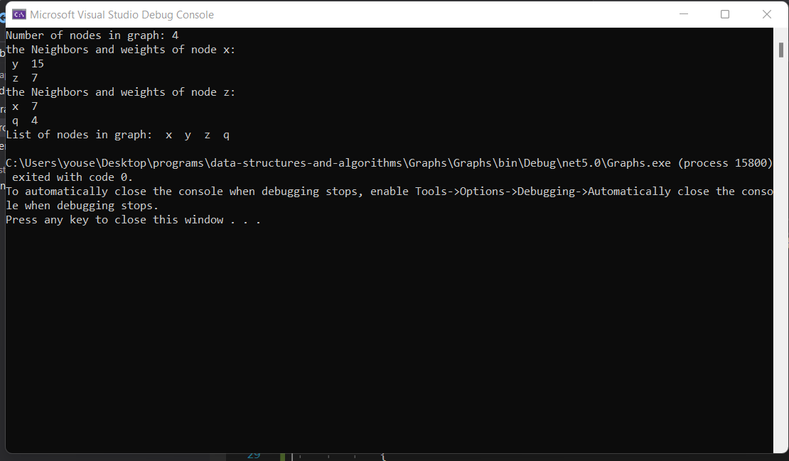
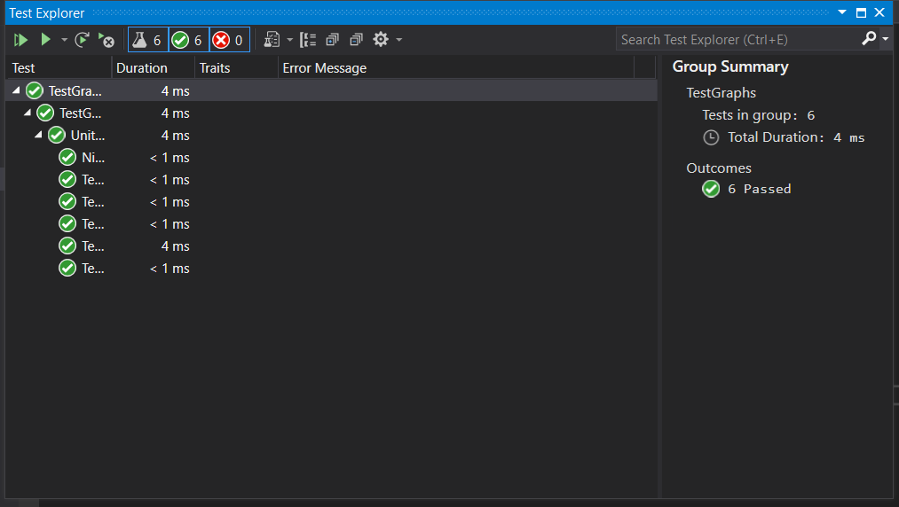

# Graphs

A graph is a non-linear data structure that can be looked at as a collection of vertices (or nodes) potentially connected by line
 segments named edges.

# Challenge

make the Graph implementation using the next methods :

AddNode

AddEdge

GetNodes

GetNeighbors

Size

# BIG O :

Method	        Time Complexity	Space Complexity
AddNode	 :             O(1)     	O(1)
AddEdge	 :             O(1)	        O(1)
GetNodes :         	   O(n)	        O(n)
GetNeighbors :	       O(n)	        O(1)
Size :	               O(1)	        O(1)

# Approach & Efficiency
Method	Time Complexity	Space Complexity
AddNode	      O(1)	           O(1)
AddEdge	      O(1)	           O(1)
GetNodes	  O(n)	           O(n)
GetNeighbors  O(n)	           O(1)
Size	      O(1)	           O(1)

# API

1. AddNode() :

take Arguments as value

Returns The added node

 and add node to the graph

2. AddEdge(): 

Adds a new edge between two nodes already exist in the Graph
have the ability to have a weight
can make two nodes to be connected by the edge

3. GetNodes() : 

no Arguments neded

Returns all of the nodes in the graph as a list

4. GetNeighbors() : 

no Arguments neded

Returns a collection of edges connected to the given node

Include the weight of the connection in the returned collection

5. Size() :

no Arguments neded
Returns the number of nodes in the graph

### Run :

### Tests :

