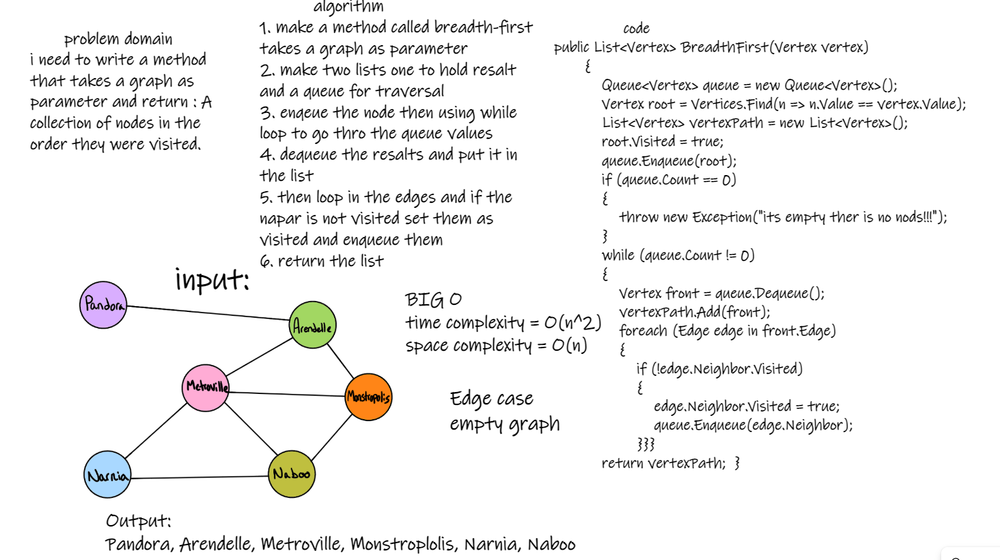
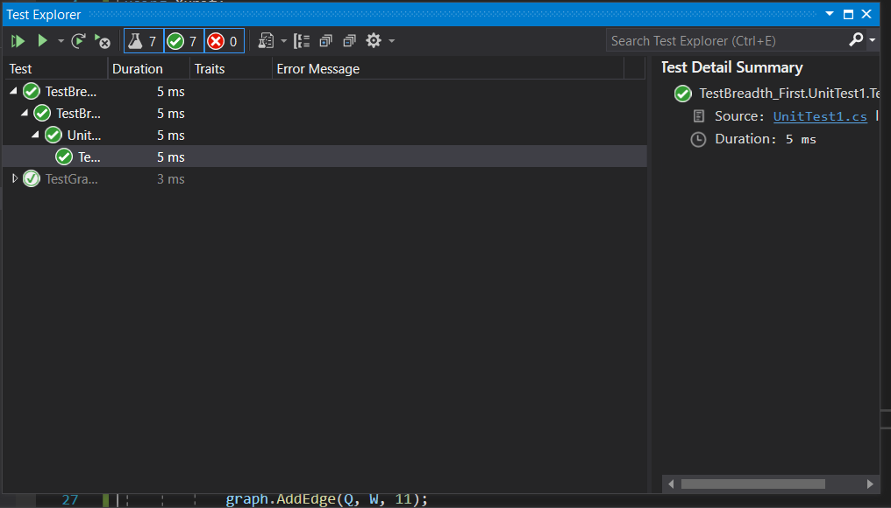

# Challenge Summary :

Implementation of graph-breadth-first traversal method in graphs to retern it ordered.

### Bord :

### Run :

### test :

### BIG O :

Time Complexity: O(n^2)
Space Complexity: O(n)

