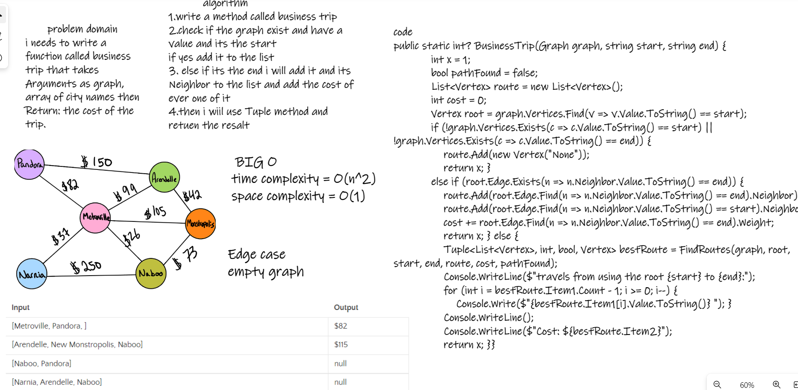
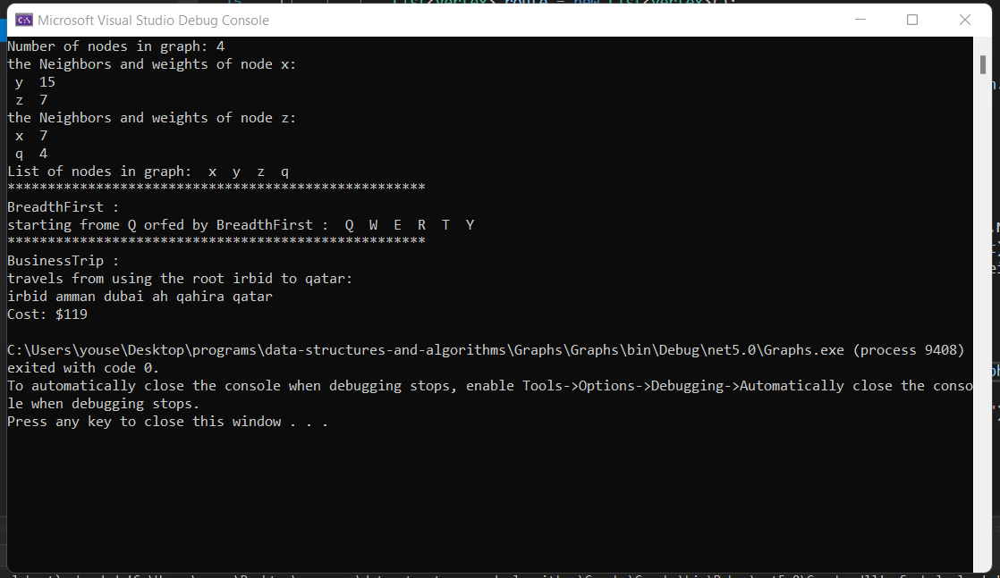
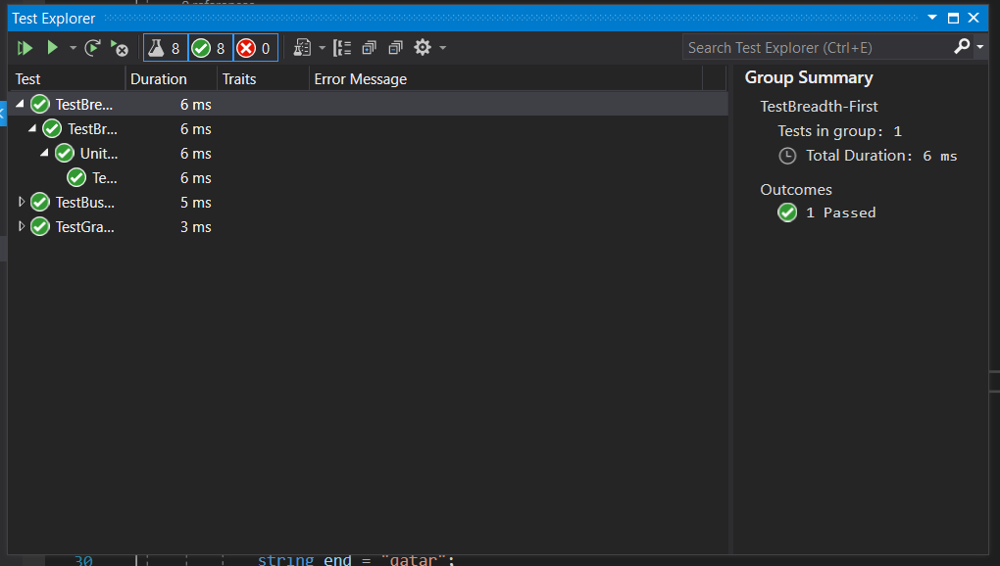

# Challenge Summary :

 write a function called business trip that takes Arguments as graph, array of city names then Return: the cost of the trip.
 
### Bord :

### Run :

### test :

### BIG O :

Time Complexity: O(n^2)
Space Complexity: O(1)