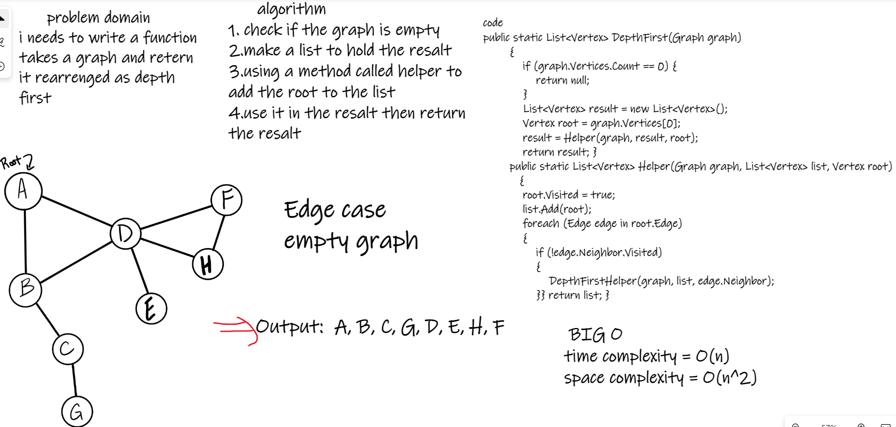
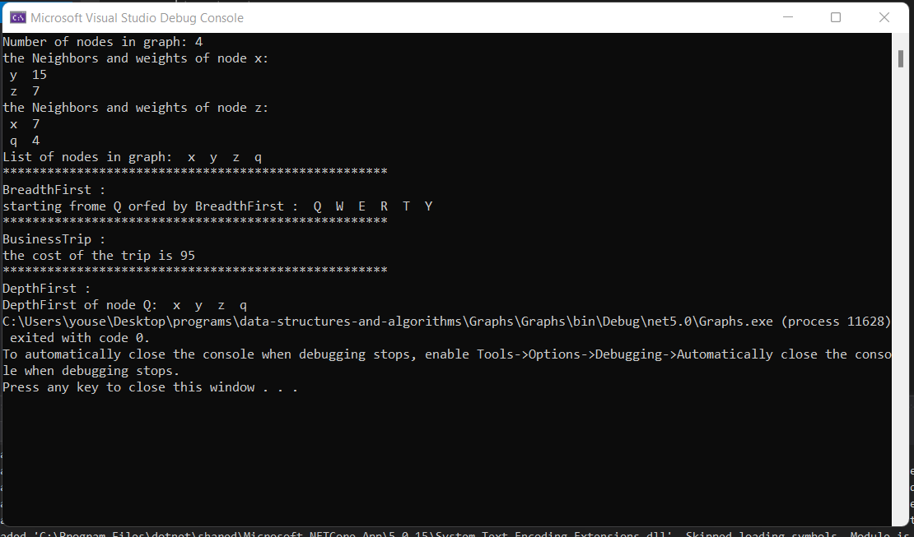
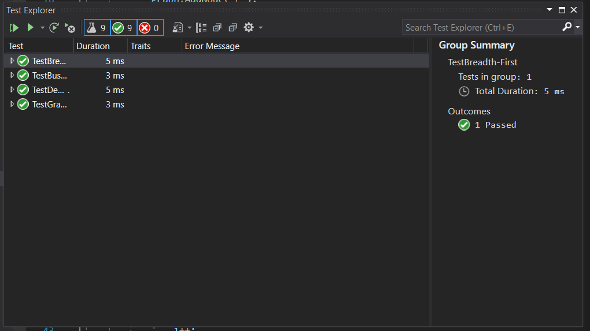

# Challenge Summary :

 i needs to write a function takes a graph and retern it rearrenged as depth first.
 
### Bord :

### Run :

### test :

### BIG O :

Time Complexity: O(n)
Space Complexity: O(n*2)