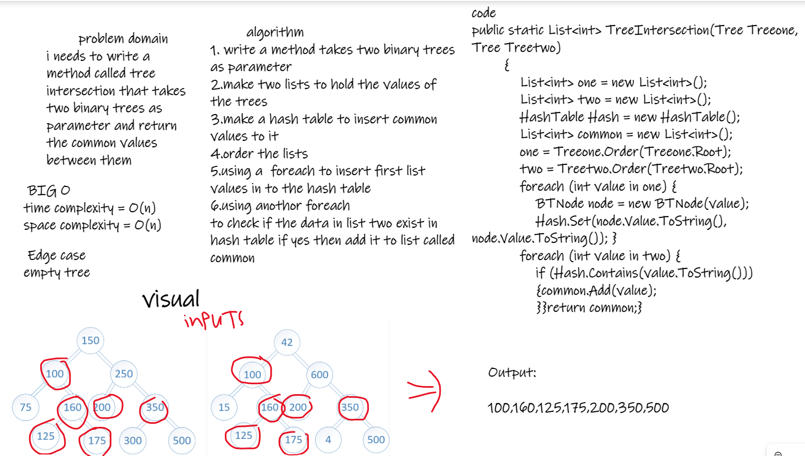
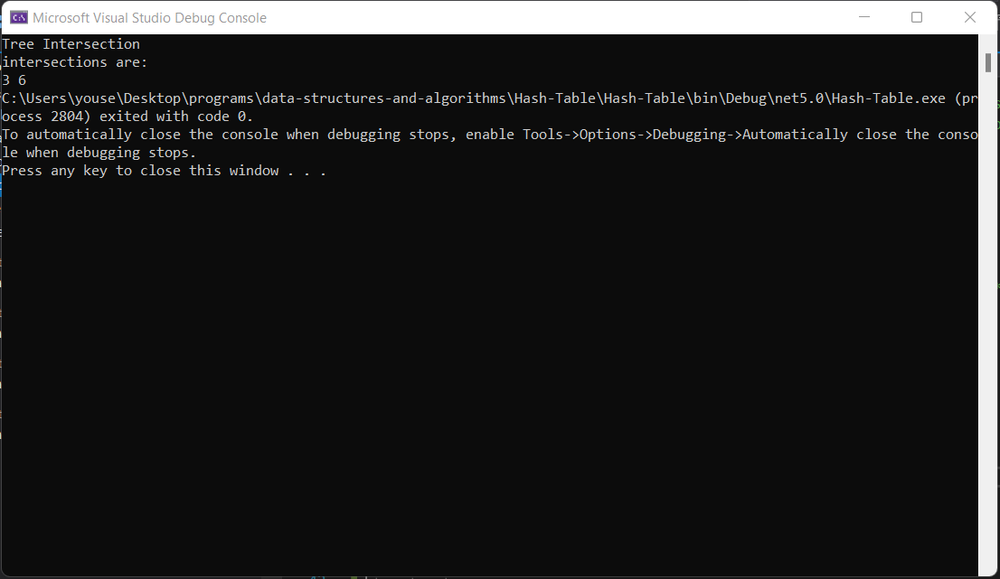
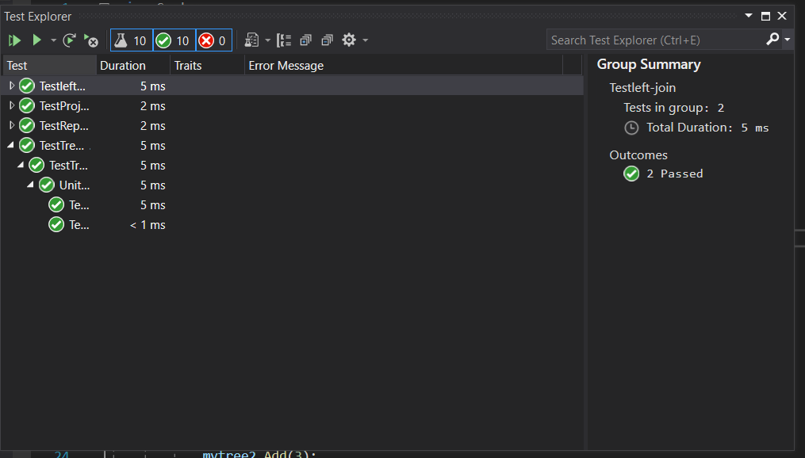

# tree intersection 

i needs to write a method called tree intersection that takes two binary trees as parameter and return the common values between 
them

### bord 

### Run 

### Tests

### BIG O
time complexity = O(n)
space complexity = O(n)

### Edge case
empty Tree

