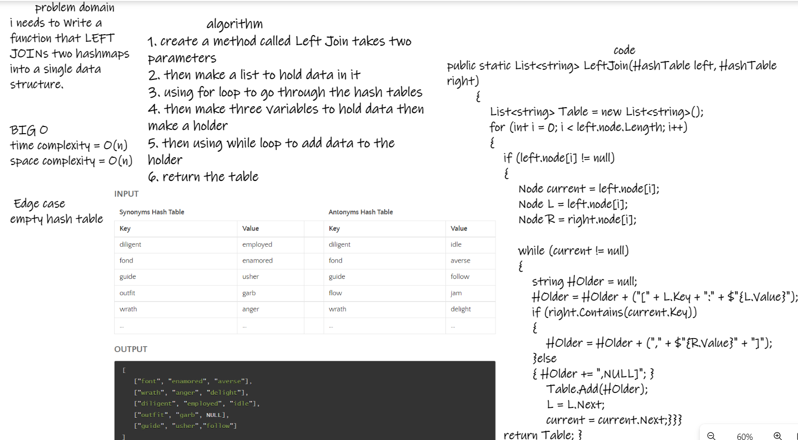
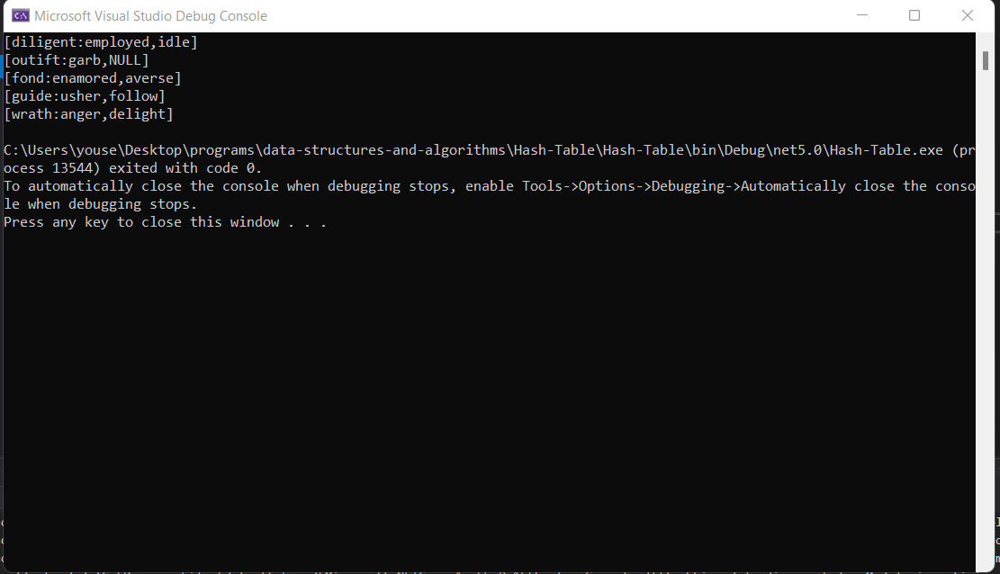
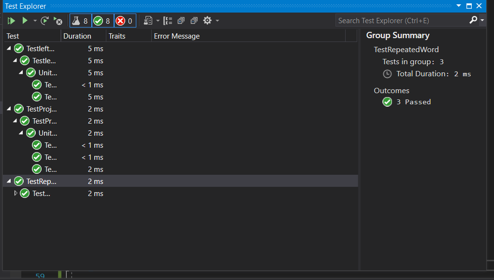

# left-join

### problem domain
i needs to Write a function that LEFT JOINs two hashmaps into a single data structure.

### bord 

### Run 

### Tests

### BIG O
time complexity = O(n)
space complexity = O(n)

### Edge case
empty hash table