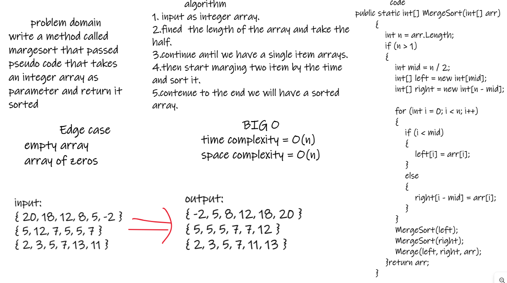
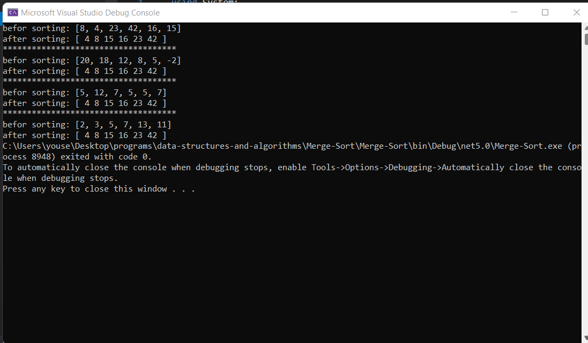
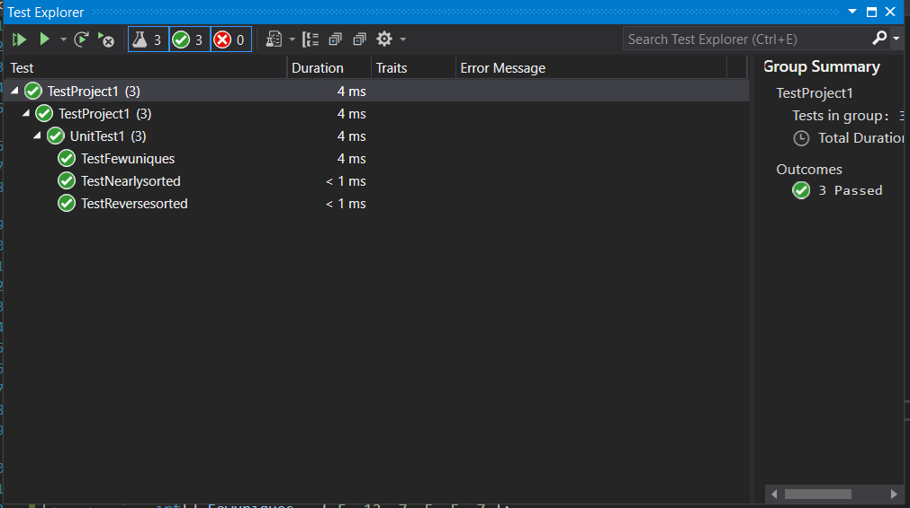

# Merge Sort

i need to write a method called margesort that passed pseudo code that takes an integer array as parameter and return it sorted and test the mthod.

### bord :

### run :

### tests :

### BIG O :
time complexity = O(n)
space complexity = O(n)

### Edge case :
1.empty array 
2.array of zeros
