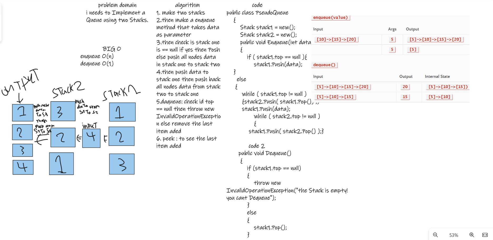

# Challenge Summary

i made a Implement a Queue using two Stacks having three metoda enqueue,dequeue and peek and printing method.

## Whiteboard Process

## Approach & Efficiency
using two stacks in checked if stack one is empity then push the data to it and if its containing data i will push the data to stack two then pueh inpoted new data to stack ine the push back data from stack two to stack one i useed this method to make a queue using staksrs

GIG O will be O(n). because of while loop

## Solution

code run :

tests :

