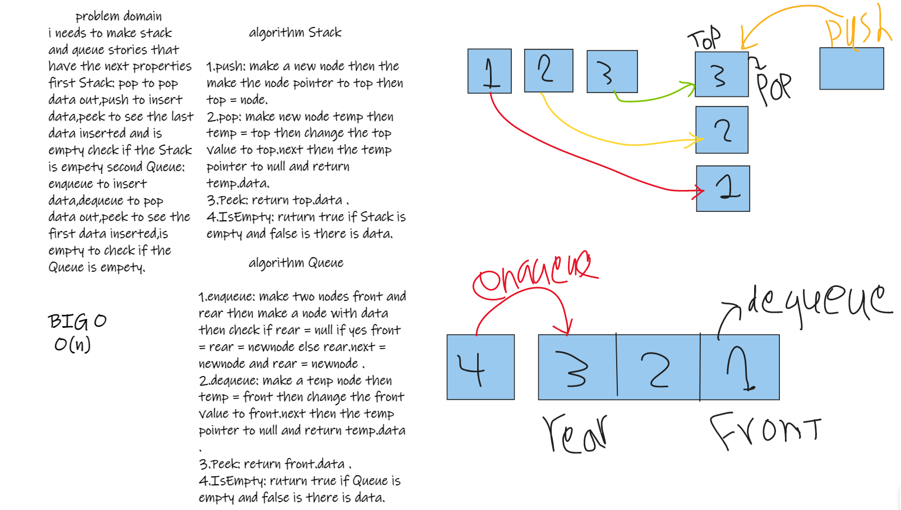
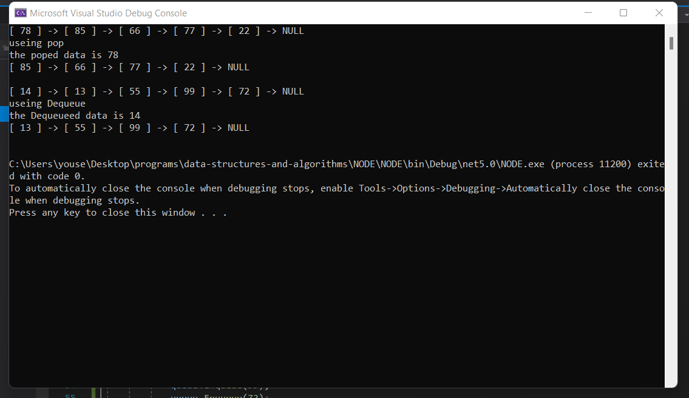
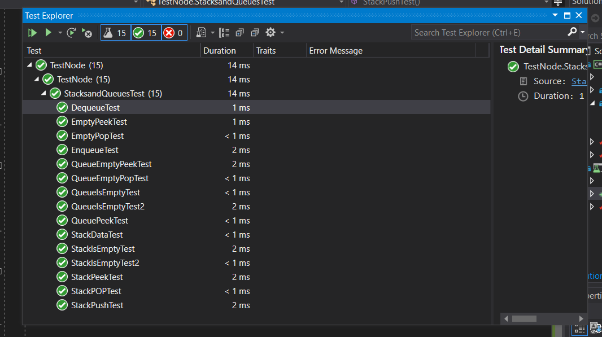

# Challenge Summary

i needs to make Stack and queue storigs that have the next properties first Stack: push,pop,peek amd is empety, second Queue enqueue,dequeue,peek and is empety.

## Whiteboard Process

## Approach & Efficiency

 Stack:

1.pop to pop data out.
2.push to insert data.
3.peek to see the last data inserted.
4.empty check if the Stack is empety.

Queue:

1.enqueue to insert data.
2.dequeue to pop data out.
3.peek to see the first data inserted.
4.isempty to check if the Queue is empety.

## Solution

## tests 

