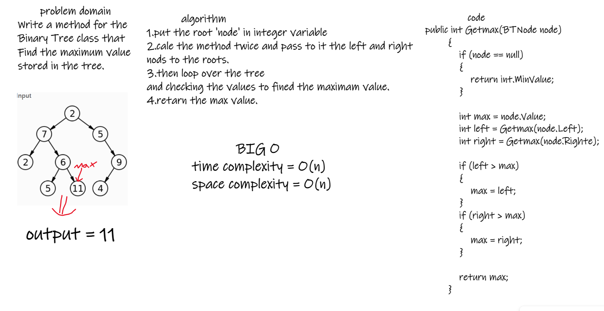

# tree-max

i did createed a method that Findd the maximum value and retern it

### bord 

### run 

### tests 

## Approach & Efficiency

time complexity = O(n)

space complexity = O(n)

## API
find maximum value stored in the tree

Arguments: node

Returns: number

