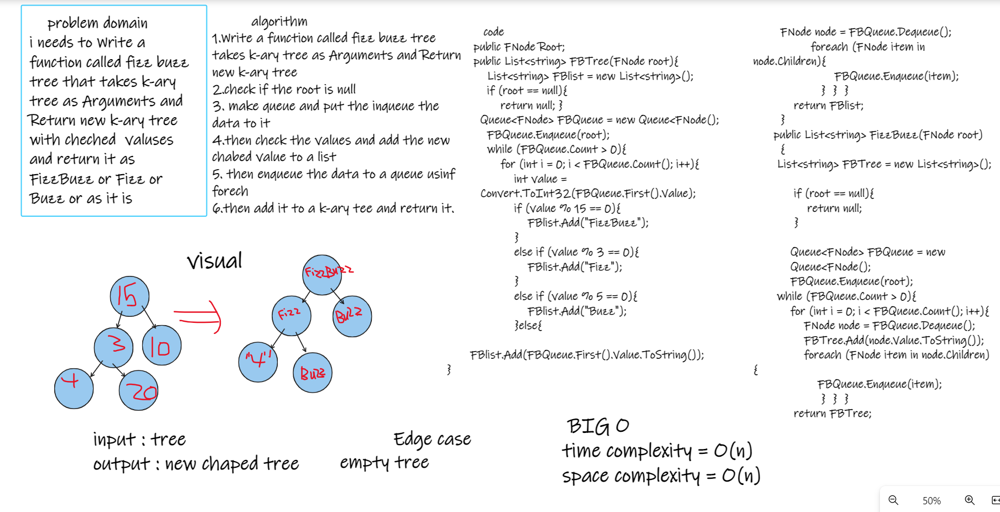

## Fizz Buzz Tree

Challenge Summary

check if the value of each nodecan be divisible by 3, 5 or both or not
1. If the value is divisible by 3 and 5, replace the value with “FizzBuzz”

2. If the value is divisible by 5, replace the value with “Buzz”

3. If the value is divisible by 3, replace the value with “Fizz”

4- If its not divisible by the numbers, turn the number into a Strin.

### Whiteboard

## Approach & Efficiency :

Time Complexity : O(n)

Space Complexity : O(n)