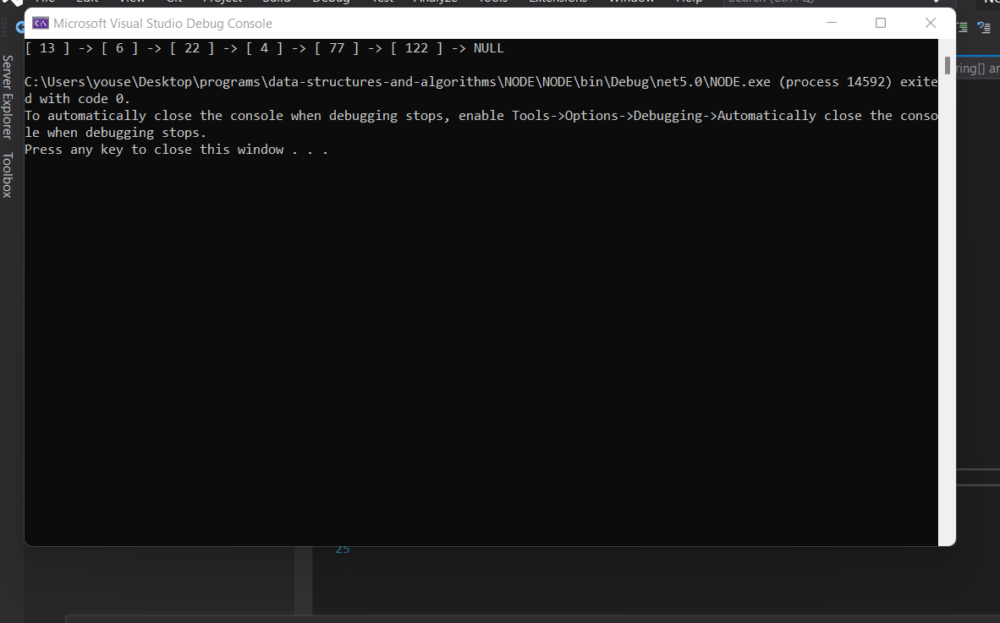
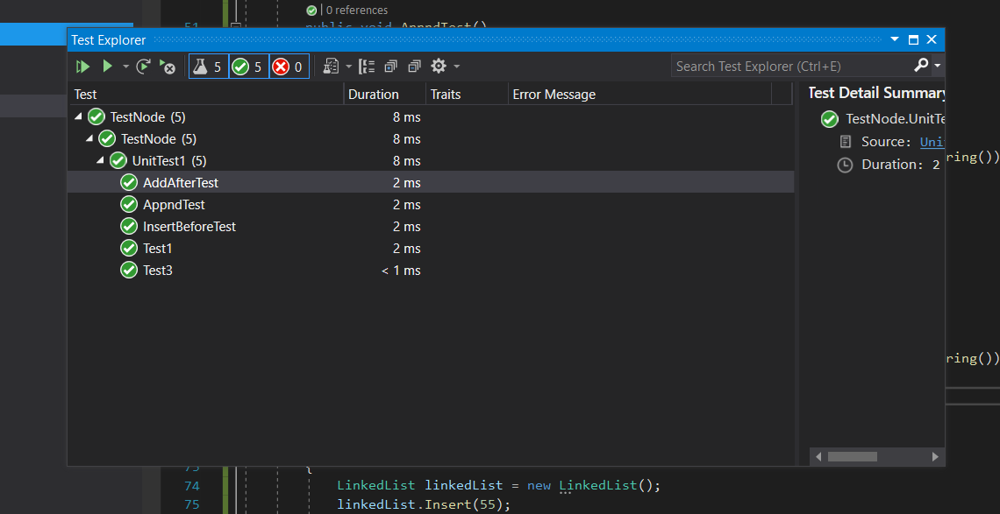
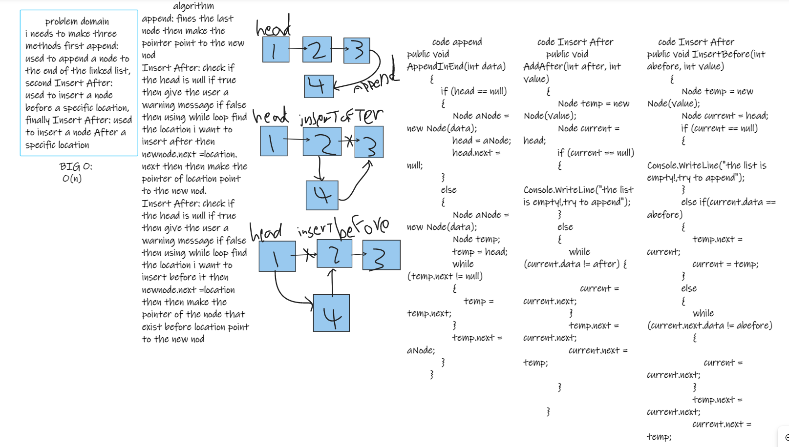

at this chalinge i needs to make three methods first method is append: used to append a node to the end of the linked list, and the second method is Insert After: used to insert a node before a specific location, and the finally method is Insert After: used to insert a node After a specific location.

# run the program

# tests

# wite bord

