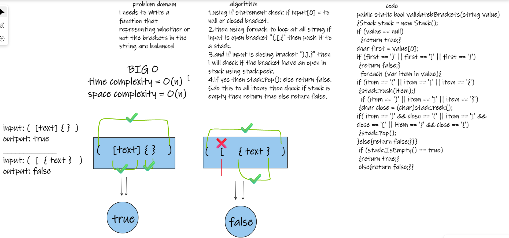
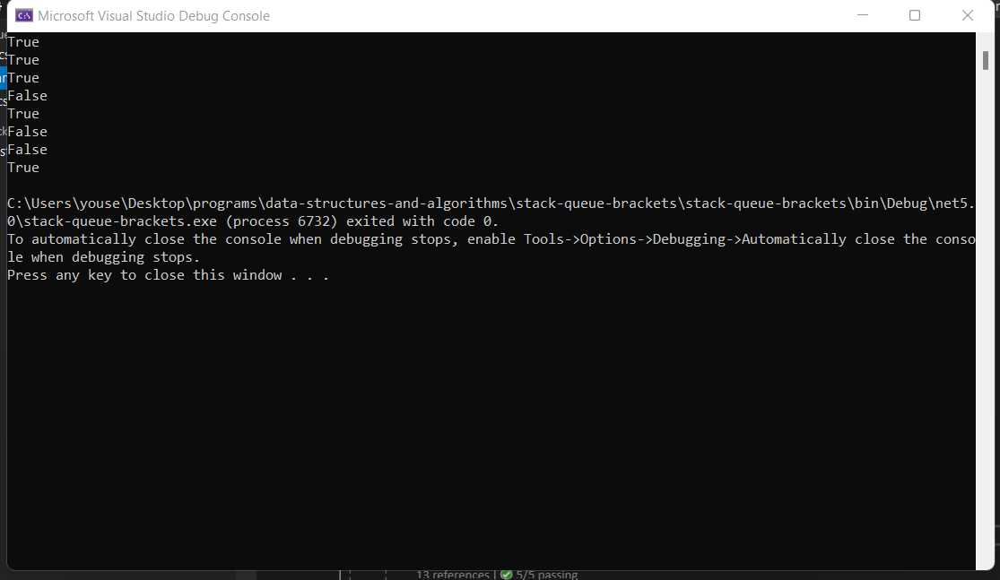
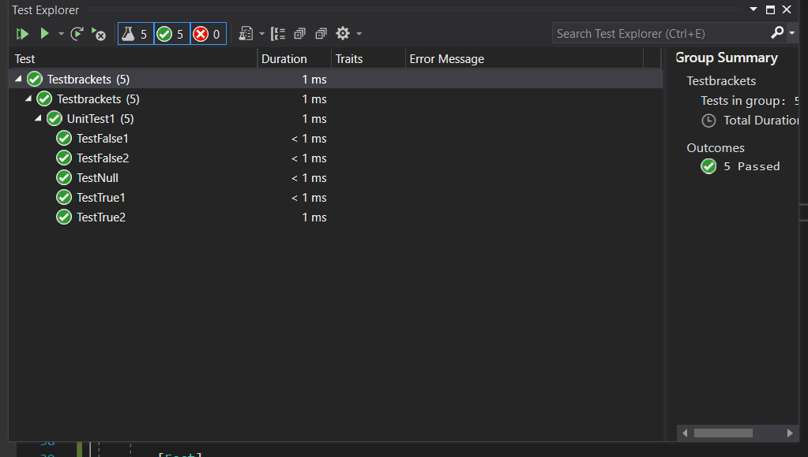

# stack-queue-brackets

i needs to Write a function that representing whether or not the brackets in the string are balanced.

BIG O :

time complexity = O(n)
space complexity = O(n)

### BORD :

### Code run :

### Test run

