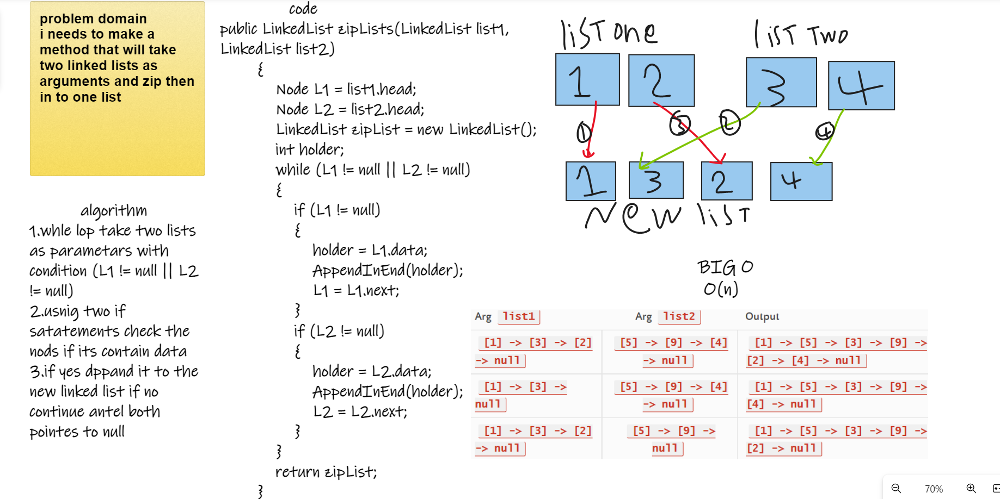

# Challenge Summary
i needs to make a method that will take two linked lists as arguments and zip then in to one list

## Whiteboard Process

## Approach & Efficiency
1.whle lop take two lists as parametars with condition (L1 != null || L2 != null) 
2.usnig two if satatements check the nods if its contain data
3.if yes dppand it to the new linked list if no continue antel both pointes to null
BOG O : O(n)

## Solution

 LinkedList list1 = new LinkedList();
            LinkedList list2 = new LinkedList();
            list1.Insert(55);
            list1.Insert(66);
            list1.Insert(77);
            list2.Insert(12);
            list2.Insert(13);
            list2.Insert(14);

            LinkedList nlist = new LinkedList();
            nlist.zipLists(list1, list2);
            Console.WriteLine(nlist.lToString());

## tests 

